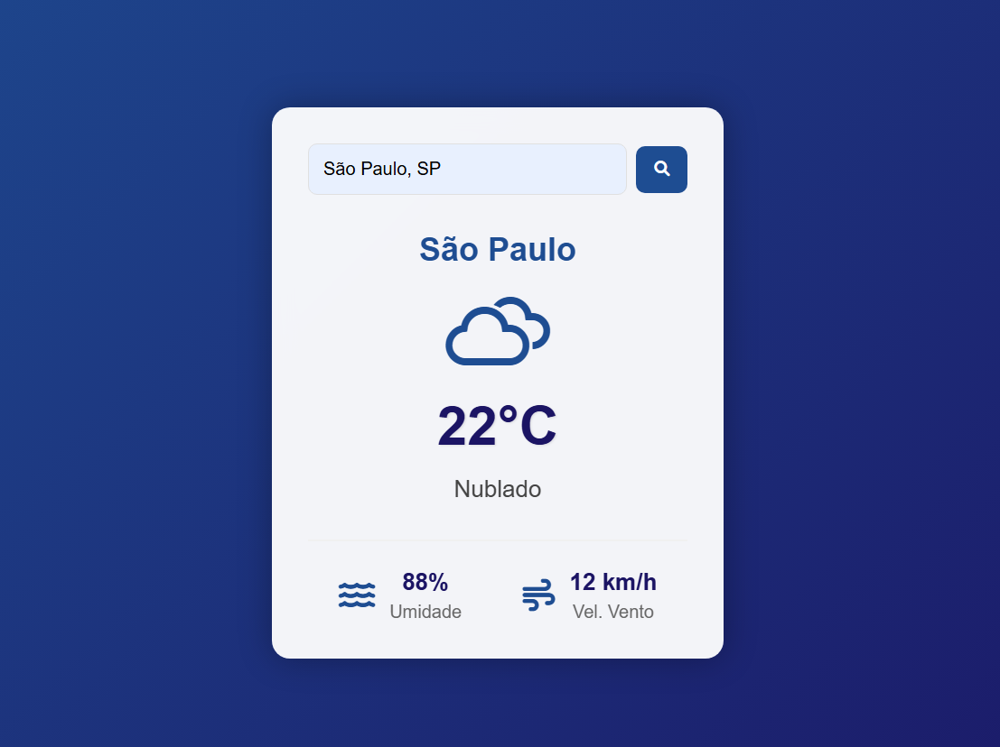

# 🌦️ WebClima | Previsão do Tempo

<div align="center">



[](https://developer.mozilla.org/en-US/docs/Web/JavaScript)
[](https://openweathermap.org/api)
[](https://developer.mozilla.org/en-US/docs/Web/CSS)

</div>

## 📋 Sobre o Projeto

Um aplicativo web moderno para consulta de previsão do tempo, desenvolvido com JavaScript puro. Oferece uma experiência de usuário fluida com animações suaves e design responsivo.

### ✨ Características

- 🔍 **Busca Inteligente**: Sugestões automáticas de cidades brasileiras
- 🎨 **Design Moderno**: Interface limpa e intuitiva
- 🌈 **Animações Suaves**: Transições fluidas para melhor experiência
- 🌍 **Dados em Tempo Real**: Integração com OpenWeather API
- 📱 **Responsivo**: Adaptável a diferentes tamanhos de tela

## 🚀 Funcionalidades

- Busca de cidades com autocompletar
- Exibição de temperatura atual
- Informações de umidade do ar
- Velocidade do vento
- Ícones dinâmicos para diferentes condições climáticas

## 🛠️ Tecnologias Utilizadas

- HTML5
- CSS3 (Animações e Flexbox)
- JavaScript (ES6+)
- OpenWeather API
- Weather Icons
- Font Awesome

## 📦 Como Usar

1. Clone o repositório:
```bash
git clone https://github.com/douglasarj/weather-app.git
```

2. Abra o arquivo `index.html` no seu navegador

3. Digite o nome de uma cidade na barra de pesquisa

4. Veja a previsão do tempo em tempo real!

## 🎯 Próximas Atualizações

- [ ] Previsão para os próximos dias
- [ ] Gráficos de temperatura
- [ ] Modo escuro
- [ ] Geolocalização
- [ ] Mais idiomas

## 🤝 Contribuindo

Contribuições são sempre bem-vindas! Sinta-se à vontade para:

1. Fazer um Fork
2. Criar uma Branch (`git checkout -b feature/AmazingFeature`)
3. Commit suas mudanças (`git commit -m 'Add some AmazingFeature'`)
4. Push para a Branch (`git push origin feature/AmazingFeature`)
5. Abrir um Pull Request

## 📄 Licença

Este projeto está sob a licença MIT. Veja o arquivo [LICENSE](LICENSE) para mais detalhes.

## 👏 Agradecimentos

- [OpenWeather](https://openweathermap.org/) pela API
- [Weather Icons](https://erikflowers.github.io/weather-icons/) pelos ícones
- [Font Awesome](https://fontawesome.com/) pelos ícones adicionais

---

<div align="center">
Feito com ❤️ por Douglas Araújo (https://github.com/douglasarj)
</div>
